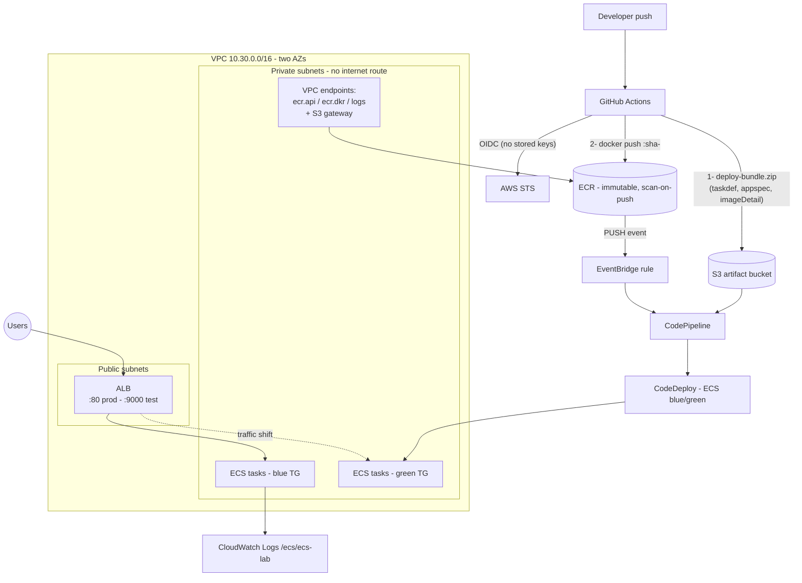

# ECS CI/CD Lab — Blue/Green Fargate Deployment

Containerized Java app on ECS Fargate in a multi-AZ VPC. GitHub Actions
builds and pushes the image to ECR (OIDC auth, immutable SHA tags);
EventBridge detects the push and starts CodePipeline, which runs a
CodeDeploy **blue/green** deployment behind a public ALB.

## Layout

```
ecs-cicd/
├── app/                          # application code (separate from infra)
│   ├── src/main/java/com/lab/App.java   # static UI: full name + lab name
│   ├── pom.xml                   # Maven build
│   ├── Dockerfile                # multi-stage, JRE alpine, non-root
│   ├── .dockerignore
│   └── deploy/
│       ├── taskdef.json          # task definition template (<IMAGE1_NAME>)
│       └── appspec.yaml          # CodeDeploy ECS appspec
├── infrastructure/
│   └── ecs_stack.yml             # full stack (GitSync-deployed)
├── param.yml                     # GitSync deployment file
└── README.md
github-eg/workflows/
└── build-deploy-ecs.yml          # CI: build -> test -> bundle -> push
```

## Architecture (diagram-as-code)



## How the pipeline works

1. Push to `ecs-cicd/app/**` → GitHub Actions (OIDC role, least privilege):
   builds the Maven project in a multi-stage Docker build, smoke tests the
   container, uploads `deploy-bundle.zip` (taskdef + appspec +
   `imageDetail.json` pointing at the new image) to S3, **then** pushes the
   image tagged `sha-<commit>` (immutable — one tag per commit, never reused).
2. EventBridge rule matches the successful ECR `PUSH` → starts CodePipeline.
3. Pipeline pulls the bundle from S3, CodeDeploy registers the new task
   definition, launches the **green** task set in private subnets, health
   checks it via the test listener (`:9000`), shifts production traffic
   (`:80`), then terminates blue after 5 minutes. Failed deployments roll
   back automatically.

## Key design decisions

- **No NAT Gateway**: tasks pull images through `ecr.api`/`ecr.dkr`
  interface endpoints + S3 gateway endpoint, ship logs via `logs` endpoint.
  Cheaper and private subnets have zero internet route (cost + security).
- **Least-privilege SGs**: ALB ← world :80/:9000; tasks ← ALB SG only :8080;
  endpoints ← task SG only :443.
- **Immutable tags**: `sha-<commit>`; ECR repo enforces `IMMUTABLE`.
- **Initial task definition** in CloudFormation runs a busybox placeholder so
  the service starts before the first image exists; the first pipeline run
  replaces it.
- Container Insights, 14-day log retention, lifecycle policies on ECR and
  the artifact bucket, all resources tagged `project: ecs-lab`.

## Setup

1. Deploy `ecs-cicd/param.yml` via CloudFormation GitSync. Set
   `CreateGitHubOidcProvider: "true"` if the account lacks the GitHub OIDC
   provider.
2. GitHub secret `AWS_ECS_PUSH_ROLE_ARN` = `GitHubPushRoleArn` stack output
   (role ARN — an identifier, not a credential).
3. Rename `github-eg/` back to `.github/` and push. First workflow run
   deploys the real app over the placeholder.

## Validation

- `AlbEndpoint` output → page shows **Gideon Dakore / ECS CI/CD Lab**.
- CloudWatch Logs `/ecs/ecs-lab` shows container output.
- Push an app change → watch Actions run → EventBridge starts the pipeline →
  CodeDeploy console shows green task set, traffic shift, blue termination.
- During the shift, `:9000` serves the new version while `:80` still serves
  the old one.
- Load test to see auto scaling (1→4 tasks at 50% average CPU):
  ```bash
  hey -z 3m -c 50 http://<ALB_DNS>/
  ```
